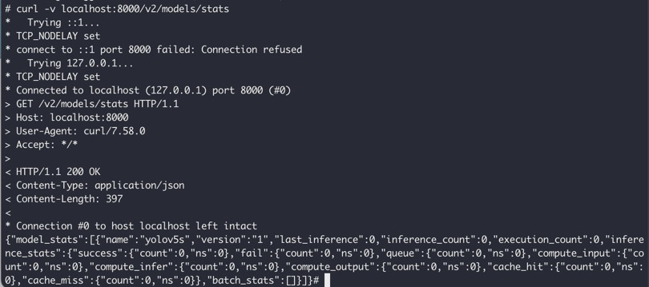

# Deploy YOLOv5 with OctoML to Docker Desktop

 1. [Introduction](#introduction)
 1. [Benefits of deploying YOLOv5 with OctoML](#benefits-of-deploying-yolov5-with-octoml)
 1. [Select your YOLOv5 candidate model](#select-your-yolov5-candidate-model)
 1. [Install Docker Desktop](#install-docker-desktop)
 1. [Create Client Code Container](#create-client-code-container)
 1. [Clone YOLOv5 repo, install requirements and export model](#clone-yolov5-repo-install-requirements-and-export-model)
 1. [Run OctoML CLI to package and deploy YOLOv5](#run-octoml-cli-to-package-and-deploy-yolov5)
 1. [Verify Triton and networking config](#verify-triton-and-networking-config)
 1. [Run Inference to Triton in OctoML model container](#run-inference-to-triton-in-octoml-container)
 
## Introduction

This follow-along tutorial is designed to help you quickly get YOLOv5 computer
vision models deployed to your local computer for inference. Below you’ll be
introduced to the [OctoML CLI](https://try.octoml.ai/cli/), a free command line
utility that packages machine learning models into deployable Docker containers
with NVIDIA Triton Inference Server. When you’re ready to deploy to production,
OctoML CLI can also be used to accelerate and deploy YOLOv5 to over 100 instance
types in AWS, Azure and GCP.

Here is the architecture of what we will be building. Your local machine will
run the OctoML CLI and Docker Desktop with two containers. The first container
will run client code to pre-process the image, request inference from Triton
Inference Server (running in a different container) and run post-processing to
embed the bounding boxes for object detection onto your original image. We will
be creating this client code container manually. The second container will be
created with OctoML CLI automatically and will host your chosen YOLOv5 model and
Triton.

Let’s start by reviewing the YOLOv5 models and their use cases.

## Benefits of deploying YOLOv5 with OctoML

Ultralytics provides [10 pretrained
checkpoints](https://github.com/ultralytics/yolov5#pretrained-checkpoints) of
YOLOv5 ranging in size and prediction accuracies. The first 5 models below,
YOLOv5n - x, take in images of size 640 x 640 pixels, while the second 5 models,
ending in ‘6’, accept larger images of size 1280 x 1280. Note that the
pre-processing code we will use in detect.py automatically resizes larger images
to the appropriate size, so you don’t have to. As you can see, the larger
models, ending in 6, have higher mean Average Precision for object detection,
but also slower inference times in the speed columns. The table below from the
Ultralytics github shows the unoptimized inference run times for the models on
an AWS p3.2xlarge instance with NVIDIA’s V100 Tensor Core GPU. These speeds
provide a high-level guide for model selection, but your actual run time can
vary significantly depending on your chosen cloud instance, CPU or GPU target,
acceleration engine (such as Apache TVM, ONNX Runtime or TensorRT) and specific
YOLOv5 model variant.

